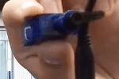
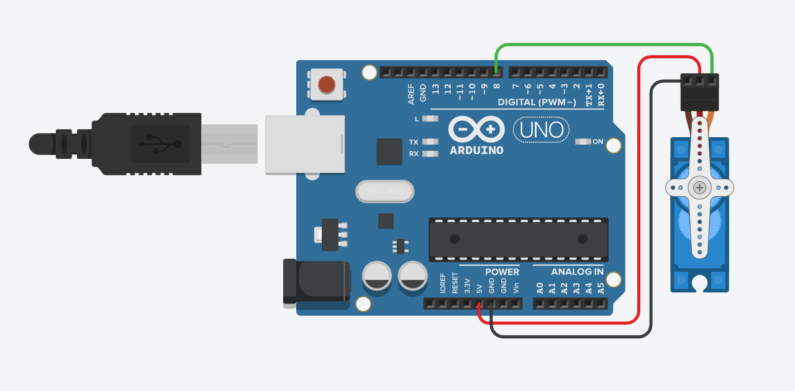

# Circuit Python
### This is my engineering notebook for Junior Year

## Table of Contents
* [Table of Contents](#TableOfContents)
* [Led_Blink_Remix](#Led_Blink_Remix)
* [CircuitPython_Servo](#CircuitPython_Servo)
* [LedUltrasonic](#LedUltrasonic)
---

## Led_Blink_Remix

### Code
I coded this on Mu.

```
    import board
    import neopixel
    import time
    led = neopixel.NeoPixel(board.NEOPIXEL, 1)

    print("Make it increase!")
    led.brightness = .25
    while True:

        colors = range(0, 100, 5)
        negative = range(100, 0, -5)

        for r in colors:
            for g in colors:
                for b in negative:

                    led.fill((r, g, b))
                    time.sleep(0.01)
```

### What does this code do?
* The code starts by setting a range from 0 to 100, and another range from 100 to 0.
* Every 0.01 seconds, the blue value changes by negative 5 from 100 to 0
* Each time the blue value reaches 0, the green value changes by positive 5 until it reaches 100
* Each time the green value reaches 100, the red value increases by 5 until it reaches 100.
* After 400 loops of the blue value going down to 0, the entire loop restarts.
* There is delay on each value change (It takes more than 0.01 seconds for each blue to decrease by 5)
---

### Wiring
The Metro plugs directly into the computer with USB.

## CircuitPython_Servo

### Description & Code

This code makes the servo turn 180 degrees, wait 1.2 seconds, and then move back, and wait another 1.2 seconds.

[Link to full code](https://github.com/afriedm49/Circuit_Python_Asher/blob/main/servo_crong.py)

```
while True:
    Angle = Spinner.angle
    
    Spinner.angle = 0
    time.sleep(1.2)
    print(Angle)
    Spinner.angle = 180
    time.sleep(1.2)
    print(Angle)

```

### Evidence



[Link to full video](https://github.com/afriedm49/Circuit_Python_Asher/blob/main/ServoVid.mp4)

### Wiring


Credit:

[sfunk02](https://github.com/sfunk02/CircuitPython/tree/main/Images)

### Reflection

The coding was somewhat difficult to figure out at first. I didn't understand how the pwm function worked. I had a lot of mistakes working on it, including file managment, syntax, and missing lines.

## LedUltrasonic

### Description & Code

This code makes an LED fade from green to blue to red, based on its distance from a surface:

```
if cm < 33:
            blue = simpleio.map_range(sonar.distance, 5, 33, 0, 255)
            green = simpleio.map_range(sonar.distance, 5, 33, 255, 0)
            g = int(green)
            b = int(blue)
            print(cm)
            led.fill((0, g, b))
```
[Full code](https://github.com/afriedm49/Circuit_Python_Asher/blob/main/ultrasonic_led_crong.py)

### Evidence


### Wiring

Credit: 

https://github.com/sfunk02/CircuitPython/blob/main/Images/ultrasonicCircuit.png

### Reflection

* First, I coded the led to just change color based on distance, without the fade, which worked, but didn't look nearly as nice. 
* I had a couple syntax problems, and didn't get the serial monitor to work for a while. 
* I started off with a faulty sensor, which wasted a good amount of time.
* I learned how to use the round function as well, to tidy up the numbers.

## Sample

### Description & Code
### Evidence
### Wiring
### Reflection
